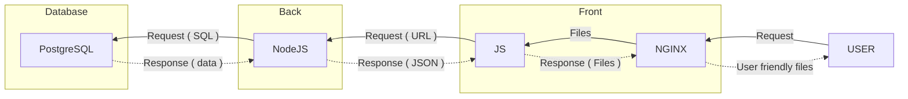

# Architecture of TODO application

```mermaid
flowchart RL
    
    USER
    
    subgraph Front
        NGINX
        JS
    end
    
    subgraph Back
        NodeJS
    end
    
    subgraph Database 
        PostgreSQL
    end
    
    USER -- Request --> NGINX
    NGINX -- Files --> JS
    JS -- "Request ( URL )" --> NodeJS
    NodeJS -- "Request ( SQL )" --> PostgreSQL
    
    PostgreSQL -. "Response ( data )" .-> NodeJS
    NodeJS -. "Response ( JSON )" .-> JS
    JS -. "Response ( Files )" .-> NGINX
    NGINX -. "User friendly files" .-> USER
        

```